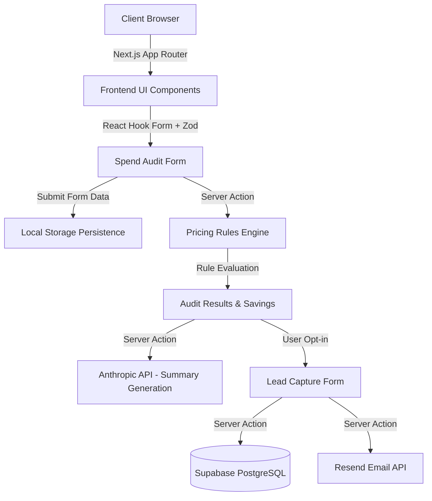

# Architecture

## System Diagram

## Data Flow
1. User inputs current AI tools stack on the client.
2. State is managed via Zustand and persisted to `localStorage`.
3. Upon submission, a Server Action processes the tools array against the `audit-engine`.
4. The engine returns deterministic savings and recommendations.
5. The frontend displays the results.
6. The user submits their email.
7. A Server Action saves the result ID and email to Supabase, and triggers a Resend confirmation email.

## Stack Reasoning
- **Next.js 15**: Provides best-in-class performance, SEO, and Server Actions for secure backend logic.
- **Tailwind + shadcn/ui**: Rapid UI development with premium, accessible, customizable components.
- **Supabase**: Instant Postgres with a simple API, perfect for MVP lead capture.

## Scaling Plan for 10k audits/day
- The pricing engine is purely computational and runs in serverless functions (Vercel). It scales infinitely.
- Supabase Postgres can easily handle 10k inserts/day (about 1 insert every 8 seconds).
- Caching: Implement Vercel edge caching for static assets.
- Rate limiting: Use Vercel KV or Upstash to rate limit Anthropic API calls to prevent abuse.
